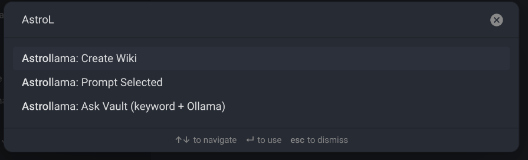

# AstroLlama

AstroLlama is an Obsidian plugin that integrates local AI models via Ollama, bringing fast, private, and flexible AI workflows directly into your notes.

It allows you to prompt AI from selected text, generate structured content, and automatically create linked wiki-style notes inside your vault. Fully local workflow (no external API required).

## ✨ Commands
- **PromptSelected**: Rewrite or expand selected text using Ollama
- **CreateWiki**: Converts a note or prompt into a structured wiki-style markdown file
- **AskVault**: Engages your vault using keyword-based retrieval and generates an AI answer using relevant notes as context

## 🧠 Architecture
- Obsidian Plugin (TypeScript)
- Local LLM inference via Ollama
- Keyword-based retrieval (AskVault)
- File-based knowledge generation (Wiki system)
- Fully offline AI workflow

## 🖼️ Screenshots

## ⚙️ Requirements
- Obsidian
- Ollama installed and running locally
- A compatible model installed (e.g. Llama, Mistral, etc.)

## 📦 Installation (Recommended)

1. Download the latest release from GitHub
2. Extract the zip file
3. Copy the folder into:
   .obsidian/plugins/astrollama/
4. Enable the plugin in Obsidian:
   Settings → Community Plugins → Enable AstroLlama
5. Restart Obsidian (if needed)

## 🛠️ Development Setup

1. Clone the repository:
   git clone https://github.com/masonmike2001/astrollama.git

2. Install dependencies:
   npm install

3. Build the plugin:
   npm run build

4. Copy build output to your vault:
   .obsidian/plugins/astrollama/

<!-- ## 📥 Recommended Install

Download the latest release:
https://github.com/masonmike2001/astrollama/releases -->

## 🛠️ Built With
- Obsidian Plugin API (TypeScript)
- Ollama local inference runtime
- Custom retrieval and prompt orchestration system

## 📌 Notes
This plugin is designed for local-first AI workflows. All processing happens through your local Ollama instance—no data is sent to external APIs.

## 📄 License

MIT License
